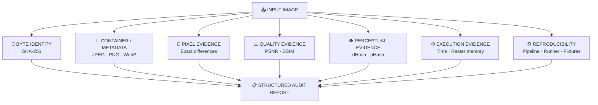
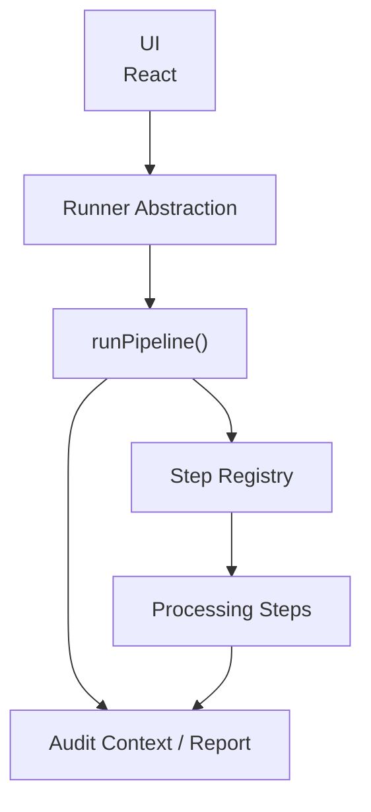
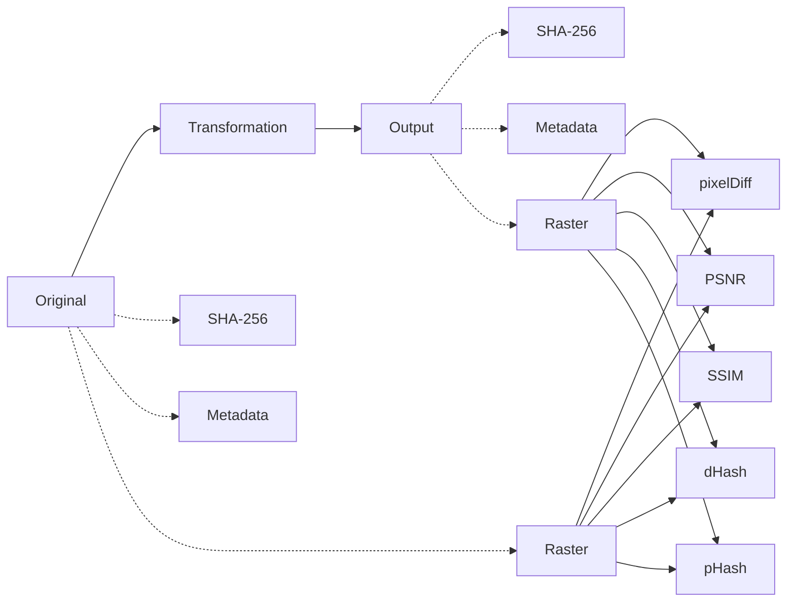
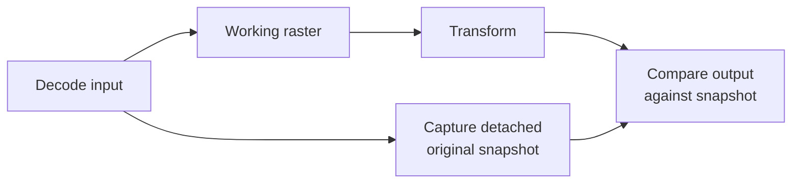
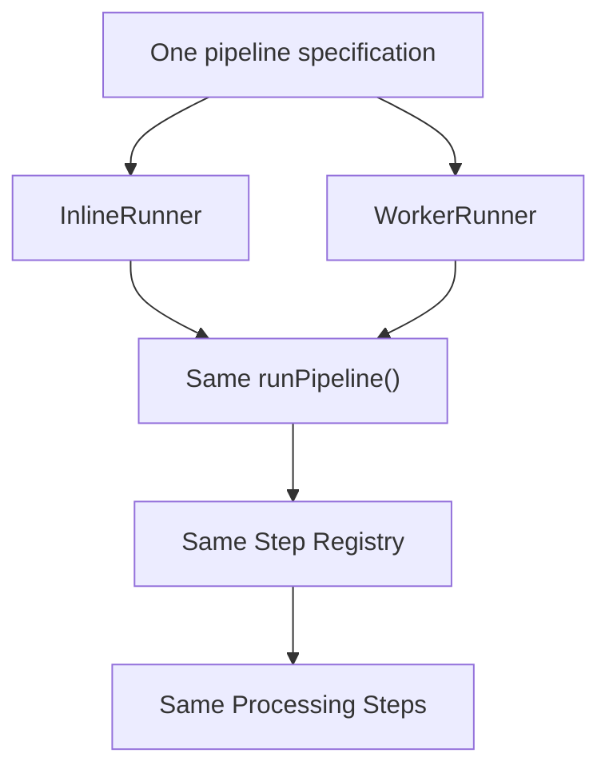
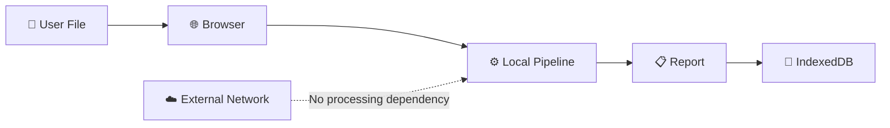
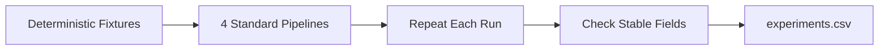
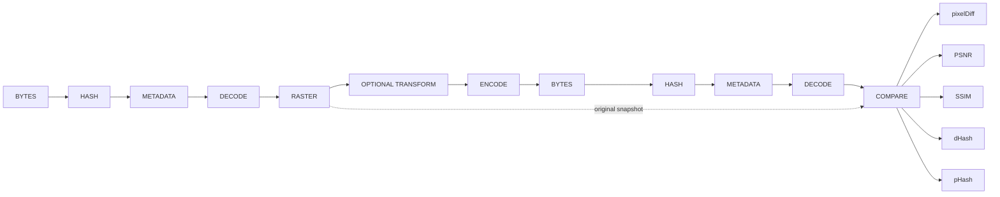
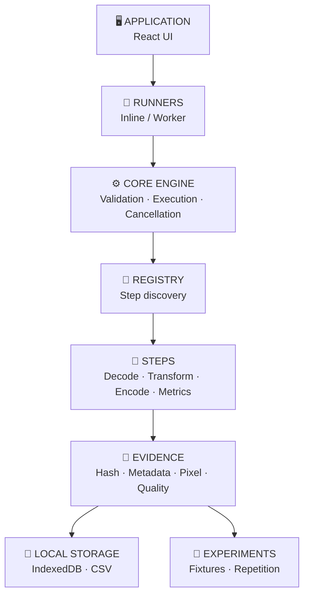

# PixelProof Lab

> ### Image Processing, Turned Into Evidence.
>
> A self-contained browser laboratory for measuring what actually changes when an image is decoded, transformed, and encoded again.
>
> **Conceived from Stage 0 and developed as a standalone system.**
>
> No application backend. No database server. No dependency on another repository.

---

# 🧭 Roadmap

PixelProof Lab was developed as a progression from a simple research question into a complete measurement instrument.

```mermaid
flowchart LR

    S0["🟣 STAGE 0<br/><b>THE IDEA</b><br/>What actually changed?"]

    S1["🔵 STAGE 1<br/><b>FOUNDATION</b><br/>Domain contracts"]

    S2["🟢 STAGE 2<br/><b>ENGINE</b><br/>Pipeline + Registry"]

    S3["🟡 STAGE 3<br/><b>IMAGE PROCESSING</b><br/>Decode → Transform → Encode"]

    S4["🟠 STAGE 4<br/><b>MEASUREMENT</b><br/>Hashes · Metadata · Quality"]

    S5["🔴 STAGE 5<br/><b>ISOLATION</b><br/>Workers · Cancellation · Offline"]

    S6["🟤 STAGE 6<br/><b>VERIFICATION</b><br/>Tests · History · Reports"]

    S7["⚫ STAGE 7<br/><b>EXPERIMENTS</b><br/>Fixtures · Repetition · CSV"]

    RESULT["🏁 RESULT<br/><b>PIXELPROOF LAB</b><br/>A measurable image-processing instrument"]

    S0 --> S1 --> S2 --> S3 --> S4 --> S5 --> S6 --> S7 --> RESULT
```



### Progress at a glance

| Stage    | Focus                  | Result                               |
| -------- | ---------------------- | ------------------------------------ |
| 🟣 **0** | Original concept       | Defined the measurement problem      |
| 🔵 **1** | Domain foundation      | Typed image-processing model         |
| 🟢 **2** | Execution architecture | Validated extensible pipeline        |
| 🟡 **3** | Processing primitives  | Real browser image transformations   |
| 🟠 **4** | Evidence & measurement | Forensic + perceptual audit layer    |
| 🔴 **5** | Execution isolation    | Worker execution + cancellation      |
| 🟤 **6** | Verification           | E2E guarantees + local evidence      |
| ⚫ **7**  | Reproducibility        | Repeatable experiments + CSV results |

---

# 💡 Stage 0 — The Original Question

Everything starts with one question:

> **When an image is processed, did the bytes, metadata, pixels, structure, or perceived appearance change — and by how much?**

Typical image-processing software focuses on:

```text
INPUT
  ↓
PROCESS
  ↓
OUTPUT
```

PixelProof adds the missing layer:

```text
INPUT
  ↓
PROCESS
  ↓
OUTPUT
  ↓
          WHAT CHANGED?
          HOW MUCH?
          WHERE?
          WHY?
          WAS IT REPRODUCIBLE?
```

This became the foundation for the entire architecture.

---

# 🧠 The Core Concept

PixelProof does not treat the output image as the final answer.

It treats the output as **evidence**.



The result is not merely an image converter.

**It is an evidence-producing laboratory for image transformations.**

---

# 🏗️ Stage 1 — Build the Foundation

The first engineering problem was defining what an image-processing pipeline actually operates on.

PixelProof explicitly separates:

```text
┌───────────────┐
│     Bytes     │
│     Blob      │
└───────┬───────┘
        │ decode
        ▼
┌───────────────┐
│     Raster    │
│ OffscreenCanvas
└───────┬───────┘
        │ transform
        ▼
┌───────────────┐
│     Raster    │
└───────┬───────┘
        │ encode
        ▼
┌───────────────┐
│     Bytes     │
│     Blob      │
└───────────────┘
```

These concepts became explicit TypeScript contracts:

```text
Bytes
Raster
Payload
Stage
Step
StepSpec
Ctx
Report
```

This prevents invalid operations such as:

```text
hash(Raster)       ❌
encode(Bytes)      ❌
decode(Raster)     ❌

hash(Bytes)        ✅
decode(Bytes)      ✅
encode(Raster)     ✅
```

The goal was to make invalid pipelines fail **before execution**, rather than discovering the problem halfway through processing.

---

# ⚙️ Stage 2 — Build the Pipeline Engine

Once the data model existed, the next problem was execution.

PixelProof separates:

```text
UI
 ↓
Runner
 ↓
Pipeline Engine
 ↓
Registry
 ↓
Step
```

### Architecture schema



### The engine validates

Before the first step executes:

```text
StepSpec
   │
   ├── known step?            ✓
   ├── valid options?         ✓
   ├── valid input stage?     ✓
   ├── valid output stage?    ✓
   ├── duplicate registration?✓
   └── ends in Bytes?         ✓
```

Only after the complete pipeline passes validation does execution begin.

This turns image processing into a **declared and validated execution model**.

---

# 🔌 Stage 3 — Build the Transformation Path

The actual image-processing path uses browser-native primitives.

```text
Blob
 │
 ▼
Magic-byte validation
 │
 ▼
createImageBitmap
 │
 ▼
OffscreenCanvas
 │
 ├───────────────┐
 │               │
 ▼               ▼
Grayscale      Resize
 │               │
 └───────┬───────┘
         ▼
   OffscreenCanvas
         │
         ▼
convertToBlob()
         │
         ▼
       Blob
```

### Current transformation primitives

| Operation   | Purpose                                |
| ----------- | -------------------------------------- |
| `decode`    | Validate and decode JPEG / PNG / WebP  |
| `grayscale` | Luma-based grayscale transformation    |
| `resize`    | Aspect-preserving maximum-width resize |
| `encode`    | PNG / JPEG / WebP output               |

The grayscale transform uses:

```text
R × 0.2126
G × 0.7152
B × 0.0722
```

Alpha is preserved.

Resize records both original and resulting dimensions.

---

# 🔬 Stage 4 — Turn Processing Into Measurement

This is where the project becomes more than a browser image-processing application.

The system measures several independent forms of evidence.



## Measurement stack

| Layer              | Measurement                     | Question answered                       |
| ------------------ | ------------------------------- | --------------------------------------- |
| 🔐 **Identity**    | SHA-256                         | Are the bytes exactly the same?         |
| 🧬 **Structure**   | Metadata / container inspection | What changed in the file structure?     |
| 🔬 **Pixels**      | Exact pixel difference          | Which pixels changed?                   |
| 📐 **Numerical**   | PSNR                            | How large is the numerical error?       |
| 🧱 **Structural**  | SSIM                            | How much structural similarity remains? |
| 👁️ **Perceptual** | dHash / pHash                   | How similar is the visual structure?    |
| 📏 **Geometry**    | Dimensions                      | Did image size change?                  |
| ⚙️ **Runtime**     | Timing / raster bytes           | What did processing cost?               |

No individual metric is treated as the truth.

The project deliberately keeps multiple forms of evidence together.

---

# 🧬 Metadata Inspection

PixelProof inspects selected structures directly from the encoded bytes.

### JPEG

```text
APP1
APP2
APP13
EXIF GPS latitude / longitude
```

### PNG

```text
eXIf
iTXt
iCCP
tEXt
```

### WebP

```text
EXIF
XMP
ICCP
```

The parser is defensive about:

```text
container boundaries
byte order
TIFF offsets
missing fields
```

The implementation reports what it can actually identify rather than claiming complete metadata coverage.

---

# 🧮 Pixel and Quality Measurements

After encoding, the output is **decoded again**.

That second decode is intentional.

```text
Original raster
      │
      │
      ├───────────────┐
      │               │
      ▼               ▼
   Transform       Output file
                      │
                      ▼
                Decode output
                      │
                      ▼
              Reconstructed raster
                      │
                      ▼
                Compare with
                original snapshot
```

This means the measurements reflect the raster that the browser actually reconstructed from the produced file.

### `pixelDiff`

Records:

```text
maximum channel difference
changed-pixel count
changed-pixel percentage
```

### PSNR

Records:

```text
luma PSNR
red
green
blue
```

### SSIM

Records:

```text
luma similarity
optional channel-level similarity
```

### dHash

Measures local brightness-gradient similarity.

### pHash

Uses low-frequency DCT-based perceptual comparison and Hamming distance.

Exact pixel comparison requires compatible raster dimensions. When dimensions differ, the report records the metric as unavailable rather than falsely reporting equality.

---

# 🧷 The Baseline Principle

One of the important architectural decisions is:

> **Never let the comparison baseline move with the transformation.**

The first decoded raster is copied into:

```text
ctx.original
```

before transformations can mutate the working raster.



This keeps the experiment anchored to the actual input state.

---

# 🧵 Stage 5 — Separate UI Work From Image Work

Large images can become expensive to process on the main browser thread.

PixelProof solves this with a shared Runner abstraction.



The important property is:

> **Worker mode changes where the pipeline runs, not what the pipeline means.**

### Worker protocol

```text
Run Request
    │
    ├── runId
    ├── Blob
    └── StepSpec[]
         │
         ▼
     Worker
         │
         ├── execute
         ├── cancellation checks
         └── report
         │
         ▼
   Matching runId
         │
         ▼
       UI
```

It supports:

* unique run identifiers;
* result messages;
* error messages;
* `AbortController` cancellation;
* controller cleanup;
* report transfer.

The E2E suite also processes a **12-megapixel raster through WorkerRunner**.

---

# 🔒 Stage 6 — Make Privacy Testable

PixelProof is designed to process files locally.

The privacy boundary is:



The project does not introduce:

```text
❌ Application backend
❌ Database server
❌ Cloud image storage
❌ Remote image-processing API
```

Network tests verify that processing:

* creates no external HTTP requests;
* works while offline;
* avoids common network-capable processing APIs such as `fetch`, `XMLHttpRequest`, `WebSocket`, `FormData`, `EventSource`, and `sendBeacon`.

The production preview also applies:

```text
default-src 'self';
connect-src 'none';
worker-src 'self' blob:;
img-src 'self' blob: data:
```

The important distinction is that the privacy boundary is not presented only as a statement.

**It is tested.**

---

# 🧪 Stage 7 — Turn the System Into an Experiment Platform

A laboratory needs repeatability.

PixelProof therefore includes deterministic fixtures and an experiment harness.



Run:

```bash
npm run experiments -- --runs=3 --out=experiments.csv
```

The harness records:

```text
fixture
pipeline
SHA change
pHash distance
dHash distance
maximum pixel difference
changed-pixel percentage
PSNR
SSIM
step timing
input bytes
output bytes
raster memory
user agent
```

Timing is treated as an observation rather than deterministic identity.

Quality and output fields are checked for stability across repetitions.

---

# 📊 Audit Report Schema

Every run produces a structured report.

```text
REPORT
│
├── input
│   ├── sha256
│   ├── metadata
│   └── byteCount
│
├── output
│   ├── sha256
│   ├── metadata
│   ├── byteCount
│   ├── encoding
│   └── resize
│
├── comparison
│   ├── pixelDiff
│   ├── PSNR
│   ├── SSIM
│   ├── pHash
│   ├── dHash
│   └── errors
│
├── timings
│   └── step → milliseconds
│
├── rasterBytes
│   └── step → width × height × 4
│
└── userAgent
```

This separation allows the report to distinguish:

```text
BYTE CHANGE
     ≠
PIXEL CHANGE
     ≠
METADATA CHANGE
     ≠
VISUAL CHANGE
     ≠
PROCESSING COST
```

That distinction is fundamental to the project.

---

# 🧩 Step Schema

Each operation is represented as a declared `StepSpec`.

```text
┌─────────────────────────────┐
│          StepSpec            │
├─────────────────────────────┤
│ type                        │
│ options                     │
│ inputStage                  │
│ outputStage                 │
└──────────────┬──────────────┘
               │
               ▼
        Registry.resolve()
               │
               ▼
        Step Factory
               │
               ▼
          Step.run()
               │
               ▼
          New Payload
```

This gives the system:

* duplicate-type protection;
* explicit unknown-step errors;
* option forwarding;
* stage validation;
* common discovery for Inline and Worker execution.

Adding a step does not require rewriting the pipeline engine.

---

# 🔄 Standard Audit Pipeline

The built-in audit pipeline is:

```text
01  hash(input)
        ↓
02  inspectMetadata(input)
        ↓
03  decode
        ↓
04  optional transform
        ├── grayscale
        └── resize
        ↓
05  encode(requested type)
        ↓
06  hash(output)
        ↓
07  inspectMetadata(output)
        ↓
08  decode output
        ↓
09  pixelDiff
        ↓
10  PSNR
        ↓
11  SSIM
        ↓
12  dHash
        ↓
13  pHash
        ↓
14  final Blob
```

The pipeline can be represented conceptually as:



---

# 🖥️ Browser Application

The browser UI exposes the laboratory without taking image-processing logic into the presentation layer.

```text
Upload
  ↓
Choose Runner
  ↓
Choose / Edit Pipeline
  ↓
Run
  ↓
Output Preview
  ↓
Audit Report
  ↓
Local History
```

The user can:

* select a file;
* drag and drop an image;
* choose Inline or Worker execution;
* select a preset;
* edit pipeline JSON;
* start processing;
* cancel processing;
* inspect the resulting report;
* preview the output;
* download the output;
* reload saved history;
* sort history;
* export history as CSV;
* delete individual records.

---

# 🗂️ Built-in Presets

| Preset              | Transform        | Output      | Purpose                          |
| ------------------- | ---------------- | ----------- | -------------------------------- |
| `no-transform-png`  | None             | PNG         | Baseline browser re-encode       |
| `no-transform-jpeg` | None             | JPEG `0.92` | Lossy encoding comparison        |
| `grayscale-png`     | Luma grayscale   | PNG         | Color → luma transformation      |
| `resize-2400-png`   | Max width `2400` | PNG         | Scaling and dimension comparison |

---

# 🧪 Verification Matrix

The verification strategy operates at several levels.

```text
                    PIXELPROOF VERIFICATION
                              │
          ┌───────────────────┼───────────────────┐
          │                   │                   │
          ▼                   ▼                   ▼
       UNIT TESTS           E2E TESTS          EXPERIMENTS
          │                   │                   │
          ▼                   ▼                   ▼
     Core contracts      Browser behavior      Repeatability
     Metric algorithms  Worker execution      Determinism
     Registry            Offline operation    Measurements
     Pipeline            CSP / network        CSV evidence
```

## Unit / integration coverage

Vitest checks:

* invalid stage wiring;
* unknown steps;
* cancellation;
* timing;
* raster-memory recording;
* pipeline termination in bytes;
* option forwarding;
* magic-byte validation;
* SHA-256 stability;
* explicit report targets;
* original-pixel preservation;
* duplicate registry protection;
* metric behavior;
* unequal dimensions;
* Hamming edge cases;
* metadata containers;
* EXIF/GPS extraction.

## Browser E2E coverage

Playwright checks:

* default page;
* controls;
* Inline / Worker selection;
* processing;
* output preview;
* download naming;
* report fields;
* drag-and-drop;
* 12-megapixel Worker processing;
* zero external requests;
* offline execution;
* forbidden network APIs;
* same-origin loading;
* CSP headers;
* history persistence;
* sorting;
* CSV export;
* deletion.

---

# 🧱 Deterministic Fixtures

Fixtures are generated locally.

They cover:

```text
transparent PNG
RGB color data
large dimensions
EXIF/GPS JPEG
corrupt bytes
PNG content with .jpg filename
other deterministic edge cases
```

Generate them with:

```bash
node scripts/generate-fixtures.mjs
```

This intentionally tests both:

```text
valid input
    +
misleading / invalid input
```

---

# 📦 Persistence Schema

Run history lives entirely inside browser storage.

```text
IndexedDB
│
└── pixelproof-local
    │
    └── runs
        │
        ├── run identity
        ├── timestamp
        ├── filename
        ├── runner
        ├── pipeline
        ├── input size
        ├── output size
        └── report
```

History can be:

```text
reloaded
sorted
exported
deleted
```

No remote database is required.

---

# 🛡️ Security & Privacy Model

```text
                    LOCAL BROWSER
┌──────────────────────────────────────────────────┐
│                                                  │
│  User File                                      │
│      │                                           │
│      ▼                                           │
│  Decode                                          │
│      │                                           │
│      ▼                                           │
│  Transform                                       │
│      │                                           │
│      ▼                                           │
│  Encode                                          │
│      │                                           │
│      ├── Audit Report                            │
│      │                                           │
│      └── IndexedDB History                       │
│                                                  │
└──────────────────────────────────────────────────┘
                       │
                       X
                 External Network
```

Implemented protections include:

* browser-local processing;
* no image-content upload;
* IndexedDB-only history;
* preview URL cleanup;
* Worker cancellation;
* restrictive CSP;
* network behavior tests;
* offline execution tests.

---

# 📐 Engineering Principles

## 01 — Separate bytes from pixels

`Bytes` and `Raster` are different categories with different valid operations.

---

## 02 — Validate before execution

An invalid pipeline should fail before partial processing begins.

---

## 03 — Preserve the original

The comparison baseline must remain detached from transformation state.

---

## 04 — Never trust a single metric

Exact identity, pixel difference, structural similarity, perceptual similarity, and metadata all describe different aspects of the result.

---

## 05 — Record what the browser actually did

Requested encoding and actual encoding are both recorded.

---

## 06 — Keep measurements honest

Unavailable comparisons are reported as unavailable.

Timing is recorded as observation rather than deterministic identity.

---

## 07 — Make important claims executable

Offline behavior, network isolation, CSP, Worker processing, persistence, and core pipeline contracts are backed by tests.

---

# 🧭 Architecture at a Glance



---

# 📁 Repository Structure

```text
.
├── index.html
├── package.json
├── vite.config.ts
├── playwright.config.ts
├── tsconfig*.json
│
├── src/
│   ├── main.tsx
│   ├── browser-entry.ts
│   │
│   ├── core/
│   │   ├── types.ts
│   │   ├── registry.ts
│   │   ├── report.ts
│   │   ├── run.ts
│   │   ├── runner.ts
│   │   └── auditPipeline.ts
│   │
│   ├── steps/
│   │   ├── index.ts
│   │   ├── decode.ts
│   │   ├── resize.ts
│   │   ├── grayscale.ts
│   │   ├── encode.ts
│   │   ├── hash.ts
│   │   ├── inspectMetadata.ts
│   │   ├── pixelDiff.ts
│   │   ├── psnr.ts
│   │   ├── ssim.ts
│   │   ├── dhash.ts
│   │   ├── phash.ts
│   │   └── measurement-utils.ts
│   │
│   ├── worker/
│   │   ├── WorkerRunner.ts
│   │   └── worker.ts
│   │
│   └── ui/
│       ├── App.tsx
│       ├── history.ts
│       └── styles.css
│
├── tests/
│   └── fixtures/
│
├── e2e/
│   ├── steps.spec.ts
│   └── network.spec.ts
│
├── docs/
│   └── network-checks.md
│
├── experiments/
│   └── README.md
│
├── scripts/
│   ├── generate-fixtures.mjs
│   └── run-experiments.mjs
│
└── experiments.csv
```

---

# 🛠️ Technology Foundation

### Application

```text
React
TypeScript
Vite
```

### Browser-native processing

```text
Blob
createImageBitmap
OffscreenCanvas
ImageData
crypto.subtle
IndexedDB
Web Workers
```

### Verification

```text
Vitest
Playwright
```

The runtime intentionally stays lightweight and browser-native.

---

# 🚀 Getting Started

## Requirements

* Node.js with npm;
* a browser supported by Playwright for E2E tests;
* dependencies installed from the committed lockfile.

## Install

```bash
npm install
```

## Development

```bash
npm run dev
```

## Build

```bash
npm run build
```

## Production preview

```bash
npm run preview -- --host 127.0.0.1 --port 4173 --strictPort
```

## Checks

```bash
npm run typecheck
npm test
npm run lint
npm run e2e
```

## Regenerate fixtures

```bash
node scripts/generate-fixtures.mjs
```

## Run experiments

```bash
npm run experiments -- --runs=3 --out=experiments.csv
```

---

# 🔭 Future Direction

The existing architecture provides expansion points for:

```text
additional image metrics
additional codecs
new transformation steps
additional browser/WASM implementations
video processing
text-based analysis
larger experimental datasets
deeper reproducibility tooling
```

The important property is that these can extend the existing contracts instead of requiring a rewrite of the core execution model.

---

# ⚠️ Known Boundaries

PixelProof deliberately does not overclaim.

* Metadata inspection covers selected markers rather than every possible metadata field.
* Exact pixel comparison requires compatible dimensions.
* Browser codec support can produce encoder fallbacks.
* Timing varies with hardware and browser conditions.
* Perceptual metrics are implementation-level indicators, not a universal quality score.
* The project is local-first rather than a hosted multi-user service.
* Local browser storage is still user data.
* There is no encrypted export or cross-device synchronization.

These boundaries are surfaced through reports, errors, tests, and documentation.

---

# 🎯 Why This Project Is Different

Many image-processing projects stop here:

```text
image
  ↓
algorithm
  ↓
new image
```

PixelProof asks what happened **around** the algorithm.

```text
                 ┌──────────────┐
                 │    IMAGE     │
                 └──────┬───────┘
                        │
        ┌───────────────┼───────────────┐
        │               │               │
        ▼               ▼               ▼
     IDENTITY        STRUCTURE       PIXELS
     SHA-256         Metadata        pixelDiff
        │               │               │
        └───────────────┼───────────────┘
                        │
                        ▼
                   TRANSFORM
                        │
                        ▼
                ┌───────────────┐
                │    OUTPUT     │
                └───────┬───────┘
                        │
        ┌───────────────┼────────────────┐
        │               │                │
        ▼               ▼                ▼
     QUALITY       PERCEPTION        EXECUTION
   PSNR / SSIM     dHash / pHash     Time / Memory
        │               │                │
        └───────────────┼────────────────┘
                        ▼
                ┌───────────────┐
                │    REPORT     │
                └───────┬───────┘
                        ▼
                REPEATABLE EVIDENCE
```

---

# 🏁 Final Perspective

PixelProof Lab began with a simple question:

> **What actually changed when an image was processed?**

From that starting point, the project was developed into a complete standalone laboratory.

The work expanded from the original concept into:

```text
QUESTION
   ↓
DOMAIN MODEL
   ↓
PIPELINE ENGINE
   ↓
TRANSFORMATION SYSTEM
   ↓
MEASUREMENT ENGINE
   ↓
WORKER EXECUTION
   ↓
PRIVACY / ISOLATION
   ↓
VERIFICATION
   ↓
EXPERIMENTATION
   ↓
EVIDENCE
```

The important contribution is not any single operation such as grayscale, resizing, hashing, or perceptual comparison.

It is the **system built around the question**.

PixelProof provides a way to take an image transformation that would normally be treated as an opaque input/output operation and turn it into a **structured, measurable, locally reproducible experiment**.

> ### **Image processing becomes evidence — not just output.**
